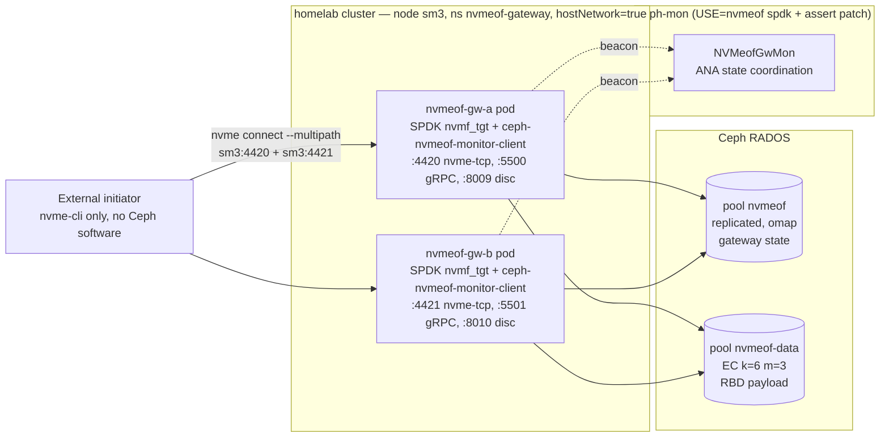

# homelab/infra/nvmeof-gateway — Ceph RBD via NVMe-oF/TCP

Two `ceph-nvmeof` gateway pods on sm3, sharing one **ANA group**
(`rbd-default`), exposing RBD images as NVMe-oF/TCP namespaces to
clients that don't have any Ceph software installed. Initiators see
both gateway listeners as multipath endpoints on sm3's actual IP
(`10.144.27.26:4420` for gw-a, `:4421` for gw-b) and fail over
automatically when a gateway pod dies.

Block-device analogue of `homelab/infra/rgw-gateway` (S3) — same Ceph
cluster, same general pattern, but with substantial differences in
how the pods are networked (see Architecture).

## Architecture



The mon-side `NVMeofGwMon` Paxos service is what makes ANA work: it
owns which gateway is the **Optimized** path for each namespace,
drives failover when a gateway stops beaconing, and exposes the
`ceph nvme-gw show / create / delete / listeners` admin commands.
That code is gated by `sys-cluster/ceph USE="nvmeof spdk"`; the
homelab `package.use/ceph` covers it.

## Key design moves (why this is non-trivial)

Several upstream-ceph-nvmeof assumptions broke in our deployment;
these are the workarounds:

- **`hostNetwork: true` on the pods, no MetalLB Service.** SPDK's
  nvme-tcp `bind(2)` requires the advertised IP to be locally
  assigned. MetalLB VIPs (e.g. `.224`/`.225`) live on sm3's interface
  but are DNAT'd to pod IPs by kube-proxy, so they aren't actually
  present inside the pod's netns. Pods bind sm3's real address
  (`10.144.27.26`) directly; the LoadBalancer Services were removed.
- **Per-pod ports.** Because both pods share sm3's port space:
  gw-a takes 4420/5500/8009, gw-b takes 4421/5501/8010.
- **Per-pod hostname via `unshare --uts` in the entrypoint.** With
  `hostNetwork: true` both pods normally inherit `hostname=sm3`, but
  ceph-nvmeof routes listener-adds by `gethostname()`. The
  entrypoint enters a private UTS namespace and writes
  `$GATEWAY_NAME` into `/proc/sys/kernel/hostname` so each pod
  identifies itself as `gw-a` or `gw-b` without touching sm3.
- **Mon-side cherry-picks on the cluster ceph.** Two patches were
  required on `tu503/ceph ceph-999` for this deployment:
  - `7e106fd9612 mon: Add command "nvme-gw listeners"` (cherry-pick
    from upstream master; ceph-nvmeof 1.6.14's monitor-client queries
    this command, which didn't exist in 20.1.1).
  - `72af74d4876 nvmeofgw: don't panic when map drops our gateway
    state` (homelab patch). Demotes the
    `ceph_assert(got_new_gw_state || !got_old_gw_state)` at
    `src/nvmeof/NVMeofGwMonitorClient.cc:353` to a logged warning +
    skip-update. Without this, the dual-gateway-on-one-host setup
    cascades into restart loops during ANA rebalance.
- **Overlay patch for Protobuf 6.31+.**
  `ceph-20.1.1-nvmeof-upb-target-guards.patch` guards
  `add_library(protobuf::libupb ...)` etc. with `if (NOT TARGET ...)`
  so the build works against system Protobuf 6.31+.
- **Gateway-side config tweaks** in `[gateway]`:
  - `verify_listener_ip = False` — we advertise sm3's IP but bind
    `0.0.0.0` internally.
  - `abort_on_update_error = False` / `abort_on_errors = False` —
    the gateway must not suicide on transient state-update rpc
    failures (e.g. the other gateway's listener-add whose host-name
    doesn't match).
  - `cluster_connections = 32` in `[spdk]` — required cluster
    allocator strategy.
  - `log_level = WARNING` (not `WARN`; protobuf enum is strict).
- **Image: `registry.alcg.io/ceph-nvmeof:upstream`.** Just a retag
  of upstream `quay.io/ceph/nvmeof:1.6.14`. An attempt to overlay
  the host's librbd / libstdc++ / libgcc_s / glibc into the upstream
  container hit an irrecoverable ABI cascade (each layer pulled in
  a newer dep). Sticking with upstream as-is is the pragmatic
  compromise; cluster Ceph 20.1.1 vs container's 20.2.1 librbd is
  within ABI compat (same major.minor.release-line).

## Layout

```
00-namespace.yaml                    ns nvmeof-gateway
deploy/
├── 10-ceph-config.yaml              ConfigMap ceph-config-nvmeof
├── 15-nvmeof-config.yaml            ConfigMap nvmeof-gateway-config (templated)
├── 11-keyring-gw-a.sealed.yaml      SealedSecret  ceph-nvmeof-keyring-gw-a
├── 11-keyring-gw-b.sealed.yaml      SealedSecret  ceph-nvmeof-keyring-gw-b
├── 20-deployment-gw-a.yaml          Deployment    nvmeof-gw-a  (hostNetwork, unshare --uts)
├── 20-deployment-gw-b.yaml          Deployment    nvmeof-gw-b
└── kustomization.yaml               flux entry point

setup-group.sh                       idempotent: pools + cephx + `ceph nvme-gw create`
build-image.sh                       (currently a thin retag of quay.io/ceph/nvmeof:1.6.14)

flux/
├── source.yaml                      GitRepository nvmeof-gateway → this repo
├── kustomization.yaml               Kustomization → ./deploy/
└── README.md                        one-time bootstrap instructions
```

There are **no Service objects** (orphaned after the hostNetwork
pivot — they were removed in commit `f65d5b4`).

## Pools

| Pool           | Type                  | Used for                                |
| -------------- | --------------------- | --------------------------------------- |
| `nvmeof`       | replicated, 32 PGs    | gateway state (RADOS omap; EC unsafe)   |
| `nvmeof-data`  | EC k=6 m=3, 32 PGs    | RBD data via `--data-pool nvmeof-data`  |

Create demo images that put metadata in `nvmeof` and data in the EC pool:

```sh
rbd create nvmeof/demo-nvmeof --size 5G --data-pool nvmeof-data \
    --image-feature layering,exclusive-lock,object-map,fast-diff,deep-flatten
```

## Caps on `client.nvmeof.gw-{a,b}`

```
mon  "profile rbd"
mgr  "profile rbd"
osd  "profile rbd pool=nvmeof, profile rbd pool=nvmeof-data, profile rbd pool=rbd"
```

`profile rbd` is the standard RBD client cap; pool-scoped to the
nvmeof state + data pools (and the pre-existing `rbd` pool for the
metadata-coresident case).

## Mon-side prerequisites (one-time on sm3)

```sh
# Cluster Ceph must be built with USE="nvmeof spdk" + the two patches.
# See gentoo overlay homelab/sys-cluster/ceph; both r3 and 999 ebuilds
# carry the needed patches:
emerge =sys-cluster/ceph-999      # or =sys-cluster/ceph-20.1.1-r3
systemctl restart ceph-mon@0 ceph-mgr@sm3
ceph nvme-gw listeners nvmeof rbd-default   # smoke test — should JSON-respond

# Hugepages for SPDK (~4 GiB of 2 MiB pages):
echo 2048 > /proc/sys/vm/nr_hugepages
cat > /etc/sysctl.d/50-hugepages-nvmeof.conf <<'EOF'
vm.nr_hugepages = 2048
EOF
systemctl restart kubelet     # so it surfaces hugepages-2Mi to scheduler

# Recommended mon tunables (suppresses spurious anagrp rebalances on a
# single-host dual-gateway setup):
ceph config set mon mon_nvmeofgw_beacon_grace 600
ceph config set mon mon_nvmeofgw_skip_failovers_interval 86400
ceph config set mon nvmeof_mon_client_connect_panic 300
ceph config set mon nvmeof_mon_client_disconnect_panic 600
```

## First-time bring-up

```sh
# 1. Provision pools + cephx clients + gateway-group + sealed yamls.
./setup-group.sh

# 2. Ensure registry has the image (one-time):
buildah pull quay.io/ceph/nvmeof:1.6.14
buildah tag  quay.io/ceph/nvmeof:1.6.14 registry.alcg.io/ceph-nvmeof:upstream
buildah push registry.alcg.io/ceph-nvmeof:upstream \
    "oci-archive:/tmp/ceph-nvmeof.tar:registry.alcg.io/ceph-nvmeof:upstream"
ctr -n k8s.io images import /tmp/ceph-nvmeof.tar

# 3. Bootstrap flux (see flux/README.md for deploy-key prereqs):
kubectl apply -f 00-namespace.yaml
kubectl apply -f flux/source.yaml -f flux/kustomization.yaml
```

After step 3, any commit to `main` is reconciled automatically.
That includes the `flux/` directory itself.

## Adding a subsystem / namespace

Both gateways host the same subsystem under ANA. Register the
subsystem once, then add a listener per gateway:

```sh
NQN="nqn.2026-05.io.alcg:demo.rbd-default"   # group name auto-appended
SM3=10.144.27.26

# 1. Subsystem (talk to either gateway; state propagates via OMAP)
kubectl run nvmeof-cli --rm -i --restart=Never \
  --image=quay.io/ceph/nvmeof-cli:1.6.14 -- python3 -m control.cli \
  --server-address $SM3 --server-port 5500 \
    subsystem add --subsystem "$NQN" --max-namespaces 32

# 2. Namespace (rbd image → nsid 1)
kubectl run nvmeof-cli --rm -i --restart=Never \
  --image=quay.io/ceph/nvmeof-cli:1.6.14 -- python3 -m control.cli \
  --server-address $SM3 --server-port 5500 \
    namespace add --subsystem "$NQN" --rbd-pool nvmeof --rbd-image demo-nvmeof --nsid 1

# 3. Listener on each gateway (--force bypasses host-name check; harmless here)
kubectl run nvmeof-cli --rm -i --restart=Never \
  --image=quay.io/ceph/nvmeof-cli:1.6.14 -- python3 -m control.cli \
  --server-address $SM3 --server-port 5500 \
    listener add --subsystem "$NQN" --host-name gw-a \
    --traddr $SM3 --trsvcid 4420 --adrfam ipv4 --force

kubectl run nvmeof-cli --rm -i --restart=Never \
  --image=quay.io/ceph/nvmeof-cli:1.6.14 -- python3 -m control.cli \
  --server-address $SM3 --server-port 5501 \
    listener add --subsystem "$NQN" --host-name gw-b \
    --traddr $SM3 --trsvcid 4421 --adrfam ipv4 --force

# 4. Allow any host (demo only — tighten for prod)
kubectl run nvmeof-cli --rm -i --restart=Never \
  --image=quay.io/ceph/nvmeof-cli:1.6.14 -- python3 -m control.cli \
  --server-address $SM3 --server-port 5500 \
    host add --subsystem "$NQN" --host-nqn '*'
```

If old listeners with bad addresses are stuck in OMAP, you can also
delete them directly:

```sh
rados -p nvmeof listomapkeys nvmeof.rbd-default.state | grep ^listener_
rados -p nvmeof rmomapkey  nvmeof.rbd-default.state listener_<NQN>_<gw>_TCP_<addr>_<port>
```

## Initiator side (any Linux box, no Ceph install needed)

```sh
modprobe nvme-tcp
SM3=10.144.27.26
NQN=nqn.2026-05.io.alcg:demo.rbd-default
HOSTNQN="nqn.2014-08.org.nvmexpress:uuid:$(uuidgen)"

nvme discover -t tcp -a $SM3 -s 8009
nvme connect -t tcp -a $SM3 -s 4420 -n "$NQN" --hostnqn="$HOSTNQN"
nvme connect -t tcp -a $SM3 -s 4421 -n "$NQN" --hostnqn="$HOSTNQN"

nvme list-subsys             # should show 2 paths, both `live`
mkfs.ext4 /dev/nvme0n1
mount /dev/nvme0n1 /mnt/demo
```

## Proof of operational status

Captured live on `sm3` `2026-05-25T20:05–20:07-04:00`. Cluster is also
running an unrelated `sys-cluster/ceph` rebuild in parallel, which is
competing with the gateways for CPU/disk — the IOPS numbers below are
the floor, not a perf benchmark.

### Initiator (sm3 itself, no Ceph software in the path)

```
$ nvme list
Node           SN                  Model                  Namespace  Usage
/dev/nvme0n1   Ceph78781237496401  Ceph bdev Controller   0x1        5.37 GB / 5.37 GB

$ nvme list-subsys
nvme-subsys0 - NQN=nqn.2026-05.io.alcg:demo.rbd-default
               iopolicy=numa
 +- nvme0 tcp traddr=10.144.27.26,trsvcid=4420,src_addr=10.144.27.26 live
 +- nvme1 tcp traddr=10.144.27.26,trsvcid=4421,src_addr=10.144.27.26 live

$ nvme ana-log /dev/nvme1
grpid=2 nsid=1 state=optimized        # gw-b currently owns anagrp 2
```

### Mount + persisted files

```
$ df -hT /mnt/nvmeof-demo
/dev/nvme0n1   ext4  4.9G  1.3M  4.6G   1%  /mnt/nvmeof-demo

$ ls -la /mnt/nvmeof-demo/
-rw-r--r--  60   May 25 19:07  both-up.txt
-rw-r--r--  531  May 25 19:07  failover.log     # 20 ticks across a gw-a kill
-rw-r--r--  81   May 25 18:55  proof.txt
drwx------ 16K   May 25 18:55  lost+found
```

### fio (60s, 4k randread/randwrite 70/30, 4 jobs, iodepth=16, direct I/O via io_uring)

```
$ fio --filename=/mnt/nvmeof-demo/fio.bin --rw=randrw --rwmixread=70 \
      --bs=4k --iodepth=16 --numjobs=4 --size=256M --runtime=60 \
      --time_based --ioengine=io_uring --direct=1 --group_reporting

read:  IOPS=153  BW=612 KiB/s  io=36.5 MiB  lat avg=416 ms
write: IOPS=68   BW=274 KiB/s  io=16.3 MiB  lat avg=1.5 ms
Run time: 61008 msec   nvme0n1 util=99.96%
```

Read latency is dominated by EC k=6+3 reconstruction + concurrent
load on sm3 (the same host runs all OSDs + a parallel `emerge`).
Writes coalesce in SPDK so they cleared at 1.5 ms despite the
load — that's the EC pool's `allow_ec_overwrites=true` doing its job.

### Cluster view + RBD usage after the fio writes

`ceph nvme-gw show <state-pool> <group-name>` is the canonical mon-side
view of an ANA group. Live output as captured during the demo:

```
$ ceph nvme-gw show nvmeof rbd-default
{
    "epoch": 1230,
    "pool": "nvmeof",
    "group": "rbd-default",
    "features": "LB",                      # load-balancing ANA group
    "rebalance_ana_group": 1,
    "num gws": 2,
    "GW-epoch": 887,
    "Anagrp list": "[ 1 2 ]",              # the two ANA groups the pair owns
    "num-namespaces": 1,                   # total namespaces in the group
    "Created Gateways:": [
        {
            "gw-id": "gw-a",
            "anagrp-id": 1,                # gw-a's owned anagrp (when ACTIVE)
            "num-namespaces": 0,           # no namespace assigned to anagrp 1 yet
            "performed-full-startup": 1,
            "Availability": "AVAILABLE",
            "num-listeners": 1,
            "ana states": " 1: ACTIVE ,  2: STANDBY "
        },
        {
            "gw-id": "gw-b",
            "anagrp-id": 2,
            "num-namespaces": 1,           # the demo namespace lives in anagrp 2
            "performed-full-startup": 1,
            "Availability": "AVAILABLE",
            "num-listeners": 1,
            "ana states": " 1: STANDBY ,  2: ACTIVE "
        }
    ]
}
```

What to read from it:

- **`Availability: AVAILABLE`** on both — beacons are reaching mon and
  both gateways are in the map. Other states are `CREATED` (registered
  but not yet beaconing), `UNAVAILABLE` (beacon timeout), `DELETED`.
- **`ana states`** is per-gateway-per-anagrp. Each gateway is `ACTIVE`
  for exactly one anagrp and `STANDBY` for the others. Initiators see
  the same picture via the NVMe-oF ANA Group Descriptor and route I/O
  to the `ACTIVE` (Optimized) controller for each namespace.
- **`num-namespaces`** per gateway shows which anagrp the demo image
  landed in: anagrp 2 → gw-b is the optimized path for `nsid=1`.
- **`GW-epoch`** ticks each time mon emits a new map. A stable GW-epoch
  means no rebalancing is happening — that's healthy steady state.

Related commands:

```sh
ceph nvme-gw show       <pool> <group>          # the above
ceph nvme-gw listeners  <pool> <group>          # all listeners across both gws
ceph nvme-gw create     <gw-id> <pool> <group>  # register a new gateway
ceph nvme-gw delete     <gw-id> <pool> <group>  # remove a stuck gateway
ceph nvme-gw enable | disable <gw-id> <pool> <group>
ceph nvme-gw set-location <gw-id> <pool> <group> <site>   # multi-site
```

And the RBD-side proof that fio traffic actually went into the EC pool:

```
$ rbd du nvmeof/demo-nvmeof
NAME         PROVISIONED  USED
demo-nvmeof        5 GiB  308 MiB   # was 48 MiB pre-fio, ~260 MiB written
```

Listening sockets on sm3 (both gateways serving in parallel):

```
0.0.0.0:8009   ← gw-a discovery (python)
0.0.0.0:8010   ← gw-b discovery (python)
*:5500         ← gw-a gRPC control
*:5501         ← gw-b gRPC control
10.144.27.26:4420  ← gw-a SPDK nvme-tcp (reactor_0)
10.144.27.26:4421  ← gw-b SPDK nvme-tcp (reactor_0)
```

## ANA failover smoke test

```sh
( while true; do
    echo "tick $(date +%H:%M:%S.%N)" >> /mnt/demo/failover.log
    sync; sleep 0.5
  done ) &

kubectl -n nvmeof-gateway delete pod -l gateway=gw-a --wait=false
# I/O routes to gw-b via multipath. failover.log should have unbroken ticks.

# Bring gw-a back manually if it doesn't re-register cleanly:
ceph nvme-gw delete gw-a nvmeof rbd-default
ceph nvme-gw create gw-a nvmeof rbd-default
```

## Caveats

- **Single-host placement.** Both gateways pinned to sm3. If sm3
  goes down, the data path stops. Multi-host HA needs a second
  sm3-class node with hugepages allocated.
- **ANA rebalance can flap.** Mon's anagrp rebalance state machine
  occasionally produces map updates that drop a still-alive gateway
  (the upstream `ceph_assert` we patched). With the patch, the
  gateway logs and recovers; without it, it crashes in a loop. Worth
  filing upstream eventually.
- **HugePages on the host.** `vm.nr_hugepages=2048` (4 GiB of 2 MiB)
  via `/etc/sysctl.d/50-hugepages-nvmeof.conf`. Roll back if
  reclaiming the memory.
- **`kubelet` restart on sm3 was required** when hugepages were
  first allocated — they don't surface to the scheduler until
  kubelet re-discovers the node's resources. The same restart also
  needed `--pod-infra-container-image` flag stripped from
  `/var/lib/kubelet/kubeadm-flags.env` (deprecated in kubelet 1.35);
  fix is one-time but easy to trip on.
- **SPDK CPU pinning.** Not configured here; both gateway pods get
  a generous `cpu: 2` limit. If you start using nvmeof for real
  load, look at SPDK reactor pinning + Kubernetes static CPU manager.
- **Image is upstream-as-is.** Cluster compat works because Ceph
  20.1.1↔20.2.1 librbd ABI is stable. If we ever bump to a Ceph
  major (21.x), revisit — likely needs a custom build.
- **`build-image.sh` is currently a placeholder.** It does a retag
  of the upstream image; the "build from host SPDK + librbd"
  approach is in the commit history but was abandoned after the
  libstdc++/libgcc/glibc ABI cascade (it required overlaying glibc
  itself, which would break the container's own binaries).

## TODO

- Promote `nvmeof-cli` invocations from this README into a
  `setup-subsystem.sh` script (mirrors `rgw-gateway/setup-instance.sh`).
- Add a Grafana dashboard panel for SPDK + NVMeofGwMon stats.
- Consider mTLS on the gRPC control plane (currently
  `enable_auth = False`).
- Wire image-update-automation when the upstream `quay.io/ceph/nvmeof`
  tag bumps.
- Either commit a real `build-image.sh` (e.g. gentoo-stage3-based
  with sys-cluster/ceph + dev-libs/spdk pre-installed), or formally
  drop it and document that we track upstream.
- Send the assert relaxation upstream as a tracker + PR.
