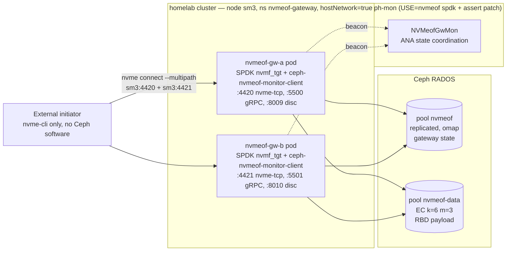

# homelab/infra/nvmeof-gateway — Ceph RBD via NVMe-oF/TCP

Two `ceph-nvmeof` gateway pods on sm3, sharing one **ANA group**
(`rbd-default`), exposing RBD images as NVMe-oF/TCP namespaces to
clients that don't have any Ceph software installed. Initiators see
both gateway listeners as multipath endpoints on sm3's actual IP
(`10.144.27.26:4420` for gw-a, `:4421` for gw-b) and fail over
automatically when a gateway pod dies.

Block-device analogue of `homelab/infra/rgw-gateway` (S3) — same Ceph
cluster, same general pattern, but with substantial differences in
how the pods are networked (see Architecture).

<details open>
<summary>

## Architecture

</summary>




The mon-side `NVMeofGwMon` Paxos service is what makes ANA work: it
owns which gateway is the **Optimized** path for each namespace,
drives failover when a gateway stops beaconing, and exposes the
`ceph nvme-gw show / create / delete / listeners` admin commands.
That code is gated by `sys-cluster/ceph USE="nvmeof spdk"`; the
homelab `package.use/ceph` covers it.

</details>

<details open>
<summary>

## Key design moves (why this is non-trivial)

</summary>


Several upstream-ceph-nvmeof assumptions broke in our deployment;
these are the workarounds:

- **`hostNetwork: true` on the pods, no MetalLB Service.** SPDK's
  nvme-tcp `bind(2)` requires the advertised IP to be locally
  assigned. MetalLB VIPs (e.g. `.224`/`.225`) live on sm3's interface
  but are DNAT'd to pod IPs by kube-proxy, so they aren't actually
  present inside the pod's netns. Pods bind sm3's real address
  (`10.144.27.26`) directly; the LoadBalancer Services were removed.
- **Per-pod ports.** Because both pods share sm3's port space:
  gw-a takes 4420/5500/8009, gw-b takes 4421/5501/8010.
- **Per-pod hostname via `unshare --uts` in the entrypoint.** With
  `hostNetwork: true` both pods normally inherit `hostname=sm3`, but
  ceph-nvmeof routes listener-adds by `gethostname()`. The
  entrypoint enters a private UTS namespace and writes
  `$GATEWAY_NAME` into `/proc/sys/kernel/hostname` so each pod
  identifies itself as `gw-a` or `gw-b` without touching sm3.
- **Mon-side cherry-picks on the cluster ceph.** Two patches were
  required on `tu503/ceph ceph-999` for this deployment:
  - `7e106fd9612 mon: Add command "nvme-gw listeners"` (cherry-pick
    from upstream master; ceph-nvmeof 1.6.14's monitor-client queries
    this command, which didn't exist in 20.1.1).
  - `72af74d4876 nvmeofgw: don't panic when map drops our gateway
    state` (homelab patch). Demotes the
    `ceph_assert(got_new_gw_state || !got_old_gw_state)` at
    `src/nvmeof/NVMeofGwMonitorClient.cc:353` to a logged warning +
    skip-update. Without this, the dual-gateway-on-one-host setup
    cascades into restart loops during ANA rebalance.
- **Overlay patch for Protobuf 6.31+.**
  `ceph-20.1.1-nvmeof-upb-target-guards.patch` guards
  `add_library(protobuf::libupb ...)` etc. with `if (NOT TARGET ...)`
  so the build works against system Protobuf 6.31+.
- **Gateway-side config tweaks** in `[gateway]`:
  - `verify_listener_ip = False` — we advertise sm3's IP but bind
    `0.0.0.0` internally.
  - `abort_on_update_error = False` / `abort_on_errors = False` —
    the gateway must not terminate on transient state-update rpc
    failures (e.g. the other gateway's listener-add whose host-name
    doesn't match).
  - `cluster_connections = 32` in `[spdk]` — required cluster
    allocator strategy.
  - `log_level = WARNING` (not `WARN`; protobuf enum is strict).
- **Image: `registry.alcg.io/ceph-nvmeof:v20.1.1-homelab`, built fully
  from local artifacts** (no upstream container in the lineage).
  `build-image.sh` assembles it from scratch via buildah:
  - SPDK `nvmf_tgt` + libs built from source at the `ceph-nvmeof-v25.09`
    pin, with the `bdev_rbd` CRC32 fast-path stubbed to plain
    `rbd_aio_write` (our librbd doesn't expose that API).
  - Host's `librbd.so` / `librados.so` / `rados-classes` / `ceph-nvmeof-monitor-client`
    from the `sys-cluster/ceph-999` install — same ABI as the daemons.
  - Host's `python3.13` (the real ELF, not the Gentoo `python-exec`
    wrapper) plus the rados/rbd Cython bindings.
  - ceph-nvmeof control-plane Python at tag 1.6.14, with gRPC stubs
    regenerated using `grpcio_tools < 1.71` (so the gencode targets
    protobuf 5.x, matching the runtime we pin), and `cli.py / state.py
    / grpc.py` patched to rename `including_default_value_fields` →
    `always_print_fields_with_no_presence` for protobuf 5.x.
  - All `ldd`-resolved deps from `/usr/lib64` (gentoo glibc, libstdc++
    from gcc-15, libabsl_*, libgrpc, libprotobuf) — same ABI as the
    monitor-client expects, since both come from this host.
  - protobuf pinned `<5` in `build-image.sh`; the 5.x runtime is
    layered on at image-bump time.

</details>

<details open>
<summary>

## Layout

</summary>


```
00-namespace.yaml                    ns nvmeof-gateway
deploy/
├── 10-ceph-config.yaml              ConfigMap ceph-config-nvmeof
├── 15-nvmeof-config.yaml            ConfigMap nvmeof-gateway-config (templated)
├── 11-keyring-gw-a.sealed.yaml      SealedSecret  ceph-nvmeof-keyring-gw-a
├── 11-keyring-gw-b.sealed.yaml      SealedSecret  ceph-nvmeof-keyring-gw-b
├── 20-deployment-gw-a.yaml          Deployment    nvmeof-gw-a  (hostNetwork, unshare --uts)
├── 20-deployment-gw-b.yaml          Deployment    nvmeof-gw-b
└── kustomization.yaml               flux entry point

setup-group.sh                       idempotent: pools + cephx + `ceph nvme-gw create`
setup-volume.sh                      idempotent: rbd image + subsystem + namespace +
                                       listeners + host allow — single command to provision
                                       a new RBD-backed NVMe-oF volume (see walkthrough below)
build-image.sh                       scratch-base buildah assembly: host
                                       librbd/librados + locally-built SPDK
                                       + ceph-nvmeof 1.6.14 python control plane
fio-compare.sh                       NVMe-oF vs krbd-direct fio sweep on raw devices

flux/
├── source.yaml                      GitRepository nvmeof-gateway → this repo
├── kustomization.yaml               Kustomization → ./deploy/
└── README.md                        one-time bootstrap instructions
```

There are **no Service objects** (orphaned after the hostNetwork
pivot — they were removed in commit `f65d5b4`).

</details>

<details>
<summary>

## Pools

</summary>


| Pool           | Type                  | Used for                                |
| -------------- | --------------------- | --------------------------------------- |
| `nvmeof`       | replicated, 32 PGs    | gateway state (RADOS omap; EC unsafe)   |
| `nvmeof-data`  | EC k=6 m=3, 32 PGs    | RBD data via `--data-pool nvmeof-data`  |

Create demo images that put metadata in `nvmeof` and data in the EC pool:

```sh
rbd create nvmeof/demo-nvmeof --size 5G --data-pool nvmeof-data \
    --image-feature layering,exclusive-lock,object-map,fast-diff,deep-flatten
```

</details>

<details>
<summary>

## Caps on `client.nvmeof.gw-{a,b}`

</summary>


```
mon  "profile rbd"
mgr  "profile rbd"
osd  "profile rbd pool=nvmeof, profile rbd pool=nvmeof-data, profile rbd pool=rbd"
```

`profile rbd` is the standard RBD client cap; pool-scoped to the
nvmeof state + data pools (and the pre-existing `rbd` pool for the
metadata-coresident case).

</details>

<details>
<summary>

## Mon-side prerequisites (one-time on sm3)

</summary>


```sh
# Cluster Ceph must be built with USE="nvmeof spdk" + the two patches.
# See gentoo overlay homelab/sys-cluster/ceph; both r3 and 999 ebuilds
# carry the needed patches:
emerge =sys-cluster/ceph-999      # or =sys-cluster/ceph-20.1.1-r3
systemctl restart ceph-mon@0 ceph-mgr@sm3
ceph nvme-gw listeners nvmeof rbd-default   # smoke test — should JSON-respond

# Hugepages for SPDK (~4 GiB of 2 MiB pages):
echo 2048 > /proc/sys/vm/nr_hugepages
cat > /etc/sysctl.d/50-hugepages-nvmeof.conf <<'EOF'
vm.nr_hugepages = 2048
EOF
systemctl restart kubelet     # so it surfaces hugepages-2Mi to scheduler

# Recommended mon tunables (suppresses spurious anagrp rebalances on a
# single-host dual-gateway setup):
ceph config set mon mon_nvmeofgw_beacon_grace 600
ceph config set mon mon_nvmeofgw_skip_failovers_interval 86400
ceph config set mon nvmeof_mon_client_connect_panic 300
ceph config set mon nvmeof_mon_client_disconnect_panic 600
```

</details>

<details>
<summary>

## First-time bring-up

</summary>


```sh
# 1. Provision pools + cephx clients + gateway-group + sealed yamls.
./setup-group.sh

# 2. Build the gateway image locally and import into containerd:
./build-image.sh
buildah push registry.alcg.io/ceph-nvmeof:v20.1.1-homelab \
    "oci-archive:/tmp/ceph-nvmeof.tar:registry.alcg.io/ceph-nvmeof:v20.1.1-homelab"
ctr -n k8s.io images import /tmp/ceph-nvmeof.tar

# 3. Bootstrap flux (see flux/README.md for deploy-key prereqs):
kubectl apply -f 00-namespace.yaml
kubectl apply -f flux/source.yaml -f flux/kustomization.yaml
```

After step 3, any commit to `main` is reconciled automatically.
That includes the `flux/` directory itself.

</details>

<details>
<summary>

## Adding a subsystem / namespace

</summary>


End-to-end provisioning is a single command:

```sh
./setup-volume.sh -i <image-name> -s <size>
# e.g. ./setup-volume.sh -i workload-01 -s 100G
```

The script creates the RBD image, the subsystem, the namespace, both
listeners, and the host allow-list (default `*`). It's idempotent —
re-runs are safe. For the underlying CLI calls (or to mutate a single
step), see the [end-to-end walkthrough](#end-to-end-new-rbd-backed-nvme-of-volume--mount-on-ubuntu-2404)
below; for emergency cleanup of OMAP listener garbage:

```sh
rados -p nvmeof listomapkeys nvmeof.rbd-default.state | grep ^listener_
rados -p nvmeof rmomapkey  nvmeof.rbd-default.state listener_<NQN>_<gw>_TCP_<addr>_<port>
```

</details>

<details>
<summary>

## Initiator side (any Linux box, no Ceph install needed)

</summary>


```sh
modprobe nvme-tcp
test -f /etc/nvme/hostnqn || \
  echo "nqn.2014-08.org.nvmexpress:uuid:$(uuidgen)" | sudo tee /etc/nvme/hostnqn

# discover-and-connect-all: picks up BOTH listeners from the discovery
# log (sm3:4420 + sm3:4421) and wires them as two paths under one
# subsystem. Don't run two `nvme connect`s by hand — connect-all gets
# multipath right.
sudo nvme connect-all -t tcp -a 10.144.27.26 -s 8009 \
    --hostnqn=$(cat /etc/nvme/hostnqn)

nvme list-subsys             # should show 2 paths, both `live`
lsblk -o NAME,SIZE,MODEL | grep "Ceph bdev"   # find the device
# then mkfs.ext4 / mount as usual; see the Ubuntu 24.04 walkthrough
# below for the persistent-mount / autoconnect pieces.
```

</details>

<details>
<summary>

## Proof of operational status

</summary>


Captured live on `sm3` `2026-05-25T20:05–20:07-04:00`. Cluster is also
running an unrelated `sys-cluster/ceph` rebuild in parallel, which is
competing with the gateways for CPU/disk — the IOPS numbers below are
the floor, not a perf benchmark.

### Initiator (sm3 itself, no Ceph software in the path)

```
$ nvme list
Node           SN                  Model                  Namespace  Usage
/dev/nvme0n1   Ceph78781237496401  Ceph bdev Controller   0x1        5.37 GB / 5.37 GB

$ nvme list-subsys
nvme-subsys0 - NQN=nqn.2026-05.io.alcg:demo.rbd-default
               iopolicy=numa
 +- nvme0 tcp traddr=10.144.27.26,trsvcid=4420,src_addr=10.144.27.26 live
 +- nvme1 tcp traddr=10.144.27.26,trsvcid=4421,src_addr=10.144.27.26 live

$ nvme ana-log /dev/nvme1
grpid=2 nsid=1 state=optimized        # gw-b currently owns anagrp 2
```

### Mount + persisted files

```
$ df -hT /mnt/nvmeof-demo
/dev/nvme0n1   ext4  4.9G  1.3M  4.6G   1%  /mnt/nvmeof-demo

$ ls -la /mnt/nvmeof-demo/
-rw-r--r--  60   May 25 19:07  both-up.txt
-rw-r--r--  531  May 25 19:07  failover.log     # 20 ticks across a gw-a kill
-rw-r--r--  81   May 25 18:55  proof.txt
drwx------ 16K   May 25 18:55  lost+found
```

### fio (60s, 4k randread/randwrite 70/30, 4 jobs, iodepth=16, direct I/O via io_uring)

```
$ fio --filename=/mnt/nvmeof-demo/fio.bin --rw=randrw --rwmixread=70 \
      --bs=4k --iodepth=16 --numjobs=4 --size=256M --runtime=60 \
      --time_based --ioengine=io_uring --direct=1 --group_reporting

read:  IOPS=153  BW=612 KiB/s  io=36.5 MiB  lat avg=416 ms
write: IOPS=68   BW=274 KiB/s  io=16.3 MiB  lat avg=1.5 ms
Run time: 61008 msec   nvme0n1 util=99.96%
```

Read latency is dominated by EC k=6+3 reconstruction + concurrent
load on sm3 (the same host runs all OSDs + a parallel `emerge`).
Writes coalesce in SPDK so they cleared at 1.5 ms despite the
load — that's the EC pool's `allow_ec_overwrites=true` doing its job.

### Cluster view + RBD usage after the fio writes

`ceph nvme-gw show <state-pool> <group-name>` is the canonical mon-side
view of an ANA group. Live output as captured during the demo:

```
$ ceph nvme-gw show nvmeof rbd-default
{
    "epoch": 1230,
    "pool": "nvmeof",
    "group": "rbd-default",
    "features": "LB",                      # load-balancing ANA group
    "rebalance_ana_group": 1,
    "num gws": 2,
    "GW-epoch": 887,
    "Anagrp list": "[ 1 2 ]",              # the two ANA groups the pair owns
    "num-namespaces": 1,                   # total namespaces in the group
    "Created Gateways:": [
        {
            "gw-id": "gw-a",
            "anagrp-id": 1,                # gw-a's owned anagrp (when ACTIVE)
            "num-namespaces": 0,           # no namespace assigned to anagrp 1 yet
            "performed-full-startup": 1,
            "Availability": "AVAILABLE",
            "num-listeners": 1,
            "ana states": " 1: ACTIVE ,  2: STANDBY "
        },
        {
            "gw-id": "gw-b",
            "anagrp-id": 2,
            "num-namespaces": 1,           # the demo namespace lives in anagrp 2
            "performed-full-startup": 1,
            "Availability": "AVAILABLE",
            "num-listeners": 1,
            "ana states": " 1: STANDBY ,  2: ACTIVE "
        }
    ]
}
```

What to read from it:

- **`Availability: AVAILABLE`** on both — beacons are reaching mon and
  both gateways are in the map. Other states are `CREATED` (registered
  but not yet beaconing), `UNAVAILABLE` (beacon timeout), `DELETED`.
- **`ana states`** is per-gateway-per-anagrp. Each gateway is `ACTIVE`
  for exactly one anagrp and `STANDBY` for the others. Initiators see
  the same picture via the NVMe-oF ANA Group Descriptor and route I/O
  to the `ACTIVE` (Optimized) controller for each namespace.
- **`num-namespaces`** per gateway shows which anagrp the demo image
  landed in: anagrp 2 → gw-b is the optimized path for `nsid=1`.
- **`GW-epoch`** ticks each time mon emits a new map. A stable GW-epoch
  means no rebalancing is happening — that's healthy steady state.

Related commands:

```sh
ceph nvme-gw show       <pool> <group>          # the above
ceph nvme-gw listeners  <pool> <group>          # all listeners across both gws
ceph nvme-gw create     <gw-id> <pool> <group>  # register a new gateway
ceph nvme-gw delete     <gw-id> <pool> <group>  # remove a stuck gateway
ceph nvme-gw enable | disable <gw-id> <pool> <group>
ceph nvme-gw set-location <gw-id> <pool> <group> <site>   # multi-site
```

And the RBD-side proof that fio traffic actually went into the EC pool:

```
$ rbd du nvmeof/demo-nvmeof
NAME         PROVISIONED  USED
demo-nvmeof        5 GiB  308 MiB   # was 48 MiB pre-fio, ~260 MiB written
```

Listening sockets on sm3 (both gateways serving in parallel):

```
0.0.0.0:8009   ← gw-a discovery (python)
0.0.0.0:8010   ← gw-b discovery (python)
*:5500         ← gw-a gRPC control
*:5501         ← gw-b gRPC control
10.144.27.26:4420  ← gw-a SPDK nvme-tcp (reactor_0)
10.144.27.26:4421  ← gw-b SPDK nvme-tcp (reactor_0)
```

</details>

<details>
<summary>

## End-to-end: new RBD-backed NVMe-oF volume → mount on Ubuntu 24.04

</summary>


A full walk-through, carving and exposing a new image and attaching it
from a fresh client. Substitute names freely.

For the cluster-side half, `setup-volume.sh` wraps steps 1–2 in a
single idempotent command:

```sh
./setup-volume.sh -i workload-01 -s 100G
# or restricted to a specific initiator NQN:
./setup-volume.sh -i secure -s 50G \
    -h nqn.2014-08.org.nvmexpress:uuid:11111111-2222-3333-4444-555555555555
```

The longer-form steps below are what the script does, useful for
debugging or when you want to mutate one step in isolation.

### Sizing decision (briefly)

Pick a metadata pool (replicated, holds RBD header + object map) and
optionally a separate data pool (typically EC for capacity). This repo
provisions both already:

| Image lives in pool…    | Data pool…                         | When |
| ---------------------- | ---------------------------------- | ---- |
| `nvmeof`               | (none — single replicated pool)    | Tiny test volumes |
| `nvmeof` (metadata)    | `nvmeof-data` (EC k=6 m=3)         | Default for real workloads |
| `rbd` or other         | `rbd-ec` etc.                      | If reusing existing pools |

### Step 1 — carve the RBD image (run on any host with admin keyring, e.g. sm3)

```sh
IMG=workload-01
SIZE=100G

rbd create nvmeof/$IMG \
    --size $SIZE \
    --data-pool nvmeof-data \
    --image-feature layering,exclusive-lock,object-map,fast-diff,deep-flatten

rbd info nvmeof/$IMG   # confirm data_pool: nvmeof-data
```

### Step 2 — register it as a namespace under a subsystem

Decide on the subsystem NQN. The convention is
`nqn.<YYYY-MM>.<reverse-fqdn>:<freeform>`. Note that ceph-nvmeof
auto-appends the ANA group name to the NQN you provide.

```sh
NQN=nqn.2026-05.io.alcg:workload-01     # mon's ANA group will append ".rbd-default"
SM3=10.144.27.26

# Helper — runs the nvmeof-cli upstream image as a one-shot pod
cli() {
  local port=$1; shift
  kubectl run nvmeof-cli --rm -i --restart=Never --quiet \
    --image=quay.io/ceph/nvmeof-cli:1.6.14 \
    --command -- python3 -m control.cli \
      --server-address $SM3 --server-port $port "$@"
}

# 1. Create the subsystem (idempotent if it already exists)
cli 5500 subsystem add --subsystem "$NQN" --max-namespaces 32

# 2. Attach the RBD image as namespace ID 1
cli 5500 namespace add \
    --subsystem "$NQN.rbd-default" \
    --rbd-pool nvmeof --rbd-image $IMG --nsid 1

# 3. Register a listener on each gateway. Use --force so the gw-id name
#    check doesn't trip on the hostNetwork+unshare-UTS setup.
cli 5500 listener add --subsystem "$NQN.rbd-default" --host-name gw-a \
    --traddr $SM3 --trsvcid 4420 --adrfam ipv4 --force
cli 5501 listener add --subsystem "$NQN.rbd-default" --host-name gw-b \
    --traddr $SM3 --trsvcid 4421 --adrfam ipv4 --force

# 4. Permit a specific host NQN, or open to any (demo-style)
cli 5500 host add --subsystem "$NQN.rbd-default" --host-nqn '*'
# For prod, restrict — generate the client's hostnqn on the initiator
# (see Step 3 below), then pass:
#   cli 5500 host add --subsystem "$NQN.rbd-default" \
#       --host-nqn nqn.2014-08.org.nvmexpress:uuid:<CLIENT-UUID>
```

Confirm the subsystem is wired:

```sh
cli 5500 subsystem list                                  # shows NQN + ns count + Allow Any Host
cli 5500 listener list --subsystem "$NQN.rbd-default"    # both listeners present
ceph nvme-gw listeners nvmeof rbd-default                # mon-side view
```

### Step 3 — attach from an Ubuntu 24.04 client

```sh
# Package install
sudo apt-get update
sudo apt-get install -y nvme-cli

# Kernel module — nvme-tcp is the transport, nvme-fabrics is the umbrella
sudo modprobe nvme-tcp
ls /dev/nvme-fabrics                                     # must exist

# Each client gets a stable host NQN. Ubuntu generates one at install
# time; use whatever's in /etc/nvme/hostnqn (or generate fresh):
sudo install -d -m 755 /etc/nvme
test -f /etc/nvme/hostnqn || sudo bash -c \
  'echo "nqn.2014-08.org.nvmexpress:uuid:$(uuidgen)" > /etc/nvme/hostnqn'
cat /etc/nvme/hostnqn

# Discover what's available at gw-a's discovery service (port 8009)
sudo nvme discover -t tcp -a 10.144.27.26 -s 8009

# Connect using --multipath via the discovery service: this picks up
# BOTH listeners (sm3:4420 and sm3:4421) from the discovery log and
# wires them as nvme0 + nvme1 under the same subsystem.
sudo nvme connect-all -t tcp -a 10.144.27.26 -s 8009 \
    --hostnqn=$(cat /etc/nvme/hostnqn)

# Verify multipath
sudo nvme list-subsys
# Should print one subsystem with iopolicy=numa and two `live` controllers.

# The block device shows up at /dev/nvmeXn1 (where X is the next free
# subsystem number). lsblk to find it deterministically:
lsblk -o NAME,SIZE,MODEL | grep "Ceph bdev"
sudo nvme list

# Format + mount (one-time)
DEV=/dev/nvme0n1                                         # adjust per lsblk
sudo mkfs.ext4 -F $DEV
sudo mkdir -p /mnt/workload-01
sudo mount $DEV /mnt/workload-01

# Want it persistent? Use the by-id path so the device name doesn't
# matter across reboots (kernel assigns nvmeX nondeterministically):
ls -la /dev/disk/by-id/ | grep nvme-Ceph
# /dev/disk/by-id/nvme-Ceph_bdev_Controller_Ceph78781237496401_1
# Add to /etc/fstab:
#   /dev/disk/by-id/nvme-Ceph_bdev_Controller_... /mnt/workload-01 ext4 \
#     defaults,_netdev,noatime,x-systemd.requires=nvmefc-connect-all.service 0 0
```

### Step 4 — autoconnect on boot (Ubuntu 24.04)

`nvme-cli` 2.x ships a systemd timer/unit that reads
`/etc/nvme/discovery.conf` and re-issues `nvme connect-all` at boot:

```sh
sudo install -d -m 755 /etc/nvme

cat | sudo tee /etc/nvme/discovery.conf <<'EOF'
# host
--transport=tcp --traddr=10.144.27.26 --trsvcid=8009
EOF

sudo systemctl enable --now nvmf-autoconnect.service
sudo systemctl status nvmf-autoconnect.service
```

After this, a reboot will re-establish both controllers automatically;
the `x-systemd.requires=` line in `/etc/fstab` ensures the mount waits
for the device to appear.

### Step 5 — verify and exercise

```sh
# Show ANA state (which path is optimized for this namespace)
sudo nvme ana-log /dev/nvme0
sudo nvme ana-log /dev/nvme1

# Quick I/O sanity
sudo dd if=/dev/urandom of=/mnt/workload-01/test.bin bs=1M count=64 oflag=direct
sudo md5sum /mnt/workload-01/test.bin

# Cluster-side proof the bytes actually traversed all the way down
ssh sm3 -- rbd du nvmeof/$IMG       # USED column climbs
```

### Tear-down

Client side:
```sh
sudo umount /mnt/workload-01
sudo nvme disconnect -n nqn.2026-05.io.alcg:workload-01.rbd-default
sudo nvme list-subsys                # subsystem should be gone
```

Cluster side:
```sh
cli 5500 namespace del --subsystem "$NQN.rbd-default" --nsid 1
cli 5500 subsystem del --subsystem "$NQN.rbd-default" --force
rbd rm nvmeof/$IMG
```

</details>

<details>
<summary>

## ANA failover smoke test

</summary>


```sh
( while true; do
    echo "tick $(date +%H:%M:%S.%N)" >> /mnt/demo/failover.log
    sync; sleep 0.5
  done ) &

kubectl -n nvmeof-gateway delete pod -l gateway=gw-a --wait=false
# I/O routes to gw-b via multipath. failover.log should have unbroken ticks.

# Bring gw-a back manually if it doesn't re-register cleanly:
ceph nvme-gw delete gw-a nvmeof rbd-default
ceph nvme-gw create gw-a nvmeof rbd-default
```

</details>

<details>
<summary>

## NVMe-oF gateway overhead vs. direct krbd

</summary>


Same RBD image (`nvmeof/workload-02`, 100 GiB, xfs), same host, same
fio job file — only the transport differs. Run on `sm3`, which
doubles as gateway host and initiator (loopback, no NIC hop), so
this isolates the SPDK gateway cost from any real network cost.

Backend A: xfs over `nvme-tcp` to both gateways (`:4420` + `:4421`,
ANA multipath via `nvme-subsys1`).
Backend B: xfs over `krbd` (`rbd map nvmeof/workload-02` → `/dev/rbd3`).
Between runs: `umount` → `nvme disconnect` → `rbd map` → remount,
then the reverse to restore. `fio-compare.sh` in this repo runs the
same comparison in a single pass (raw devices, no fs).

Job file (`/tmp/fio-baseline.ini`):

```ini
[global]
ioengine=libaio
direct=1
group_reporting=1
runtime=30
time_based=1
ramp_time=2
filename=/mnt/workload-02/fio-test.bin
size=4G
refill_buffers=1

[seq-write-1M] stonewall ; rw=write     ; bs=1M ; iodepth=8
[seq-read-1M]  stonewall ; rw=read      ; bs=1M ; iodepth=8
[rand-write-4k]stonewall ; rw=randwrite ; bs=4k ; iodepth=32
[rand-read-4k] stonewall ; rw=randread  ; bs=4k ; iodepth=32
```

Results (`sync && echo 3 > /proc/sys/vm/drop_caches` before each run):

| Test                       | NVMe-oF (nvme-tcp ×2)        | Direct krbd                 | Δ                  |
|----------------------------|------------------------------|-----------------------------|--------------------|
| seq write  1M, iod=8       | 38.5 MiB/s · 38 IOPS · 208 ms | 38.4 MiB/s · 38 IOPS · 208 ms | tie                |
| seq read   1M, iod=8       | 27.9 MiB/s · 27 IOPS · 288 ms | 108  MiB/s · 107 IOPS · 74 ms | **3.87× krbd**     |
| rand write 4k, iod=32      | 403 KiB/s · 99 IOPS · 326 ms  | 356 KiB/s · 87 IOPS · 362 ms  | tie (within noise) |
| rand read  4k, iod=32      | 6.6 MiB/s · 1691 IOPS · 20.6 ms | 10.7 MiB/s · 2730 IOPS · 11.7 ms | **1.62× krbd**     |

Takeaways:

- **Writes are transport-independent.** Both paths bottleneck on
  RADOS replication into the EC `nvmeof-data` pool; the SPDK gateway
  adds no measurable write overhead on this cluster (write IOPS,
  bandwidth and avg latency all match within run-to-run noise).
- **Reads pay a real gateway tax.** Sequential reads are ~3.9×
  slower over `nvme-tcp` and random reads ~1.6× slower. krbd issues
  parallel librados ops and benefits from kernel read-ahead; the
  SPDK reactor's per-namespace serialization is the apparent
  ceiling.
- **Same-host caveat.** Both runs are loopback. A remote initiator
  over a real NIC would add `nvme-tcp` framing/TCP cost to backend
  A only, widening the read gap further — but giving NVMe-oF its
  actual advantage: zero Ceph software on the client.
- **Absolute numbers are homelab-scale** (one EC k=6+3 pool on one
  host, parallel `emerge` not necessarily quiesced). The ratio is
  the portable finding; the magnitudes are not.

Raw fio output preserved under `/tmp/fio-results/{nvmeof,krbd}.txt`
on `sm3` for cross-checking.

</details>

<details>
<summary>

## NVMe→RBD translation: where does the overhead live?

</summary>


When the SPDK gateway receives an NVMe command on the wire, four layers
sit between it and the OSDs. Source paths reference SPDK at the
`ceph-nvmeof-v25.09` pin (the submodule ceph-nvmeof 1.6.14 ships):

1. **NVMe-TCP wire** — `lib/nvmf/tcp.c`. The reactor poll loop
   reads PDUs (CapsuleCmd, H2C_Data, etc.), pulls the 64-byte NVMe
   command out of the capsule, and hands it up.
2. **Fabric dispatch** — `lib/nvmf/ctrlr.c`. Validates the command,
   picks the namespace, splits admin vs I/O.
3. **NVMe-opcode → bdev-IO** — `lib/nvmf/ctrlr_bdev.c`:
    - `nvmf_bdev_ctrlr_read_cmd()` (line 440) extracts `start_lba`
      and `num_blocks` from the NVMe command, calls
      `spdk_bdev_readv_blocks_ext()` with an `accel_sequence` for
      optional DMA/CRC offload, and returns
      `SPDK_NVMF_REQUEST_EXEC_STATUS_ASYNCHRONOUS` while the bdev
      submits.
    - `nvmf_bdev_ctrlr_write_cmd()` (line 493) is the symmetric
      write path; threads the precomputed CRC32c through
      `spdk_bdev_ext_io_opts` so bdev_rbd can pick the with-CRC
      variant when librbd supports it.
4. **bdev → librbd** — `module/bdev/rbd/bdev_rbd.c`, the `switch
   (bdev_io->type)` around line 732:

   ```c
   case SPDK_BDEV_IO_TYPE_READ:           rbd_aio_read()
   case SPDK_BDEV_IO_TYPE_WRITE:          rbd_aio_write()         /* ← our path */
   case SPDK_BDEV_IO_TYPE_UNMAP:          rbd_aio_discard()
   case SPDK_BDEV_IO_TYPE_FLUSH:          rbd_aio_flush()
   case SPDK_BDEV_IO_TYPE_WRITE_ZEROES:   rbd_aio_write_zeroes()
   case SPDK_BDEV_IO_TYPE_COMPARE_AND_WRITE: rbd_aio_compare_and_writev()
   ```

   Past this point it's `librbd.so → librados.so → wire to OSDs`
   (the EC encode happens client-side in librbd). **No SPDK code is
   on the data path beyond this call.**

The completion ride is the mirror image: librbd → `bdev_rbd_finish_aiocb`
(line 727) → `bdev_rbd_io_complete` → bdev generic → `nvmf_bdev_ctrlr_complete_cmd`
→ TCP PDU back to the initiator.

What this means for the latency budget vs. krbd:

- TCP parse + opcode switch + LBA math: **tens of µs**. Negligible
  next to RADOS round-trips.
- The 200–400 ms p99 we see on EC writes is **librbd → OSD EC k=6+3
  commit**. Same code krbd's `rbd.ko` runs, just from kernelspace.
- Real SPDK gateway tax, in order of cost:
    1. One extra TCP socket hop on both the request and reply leg —
       the krbd client doesn't have it.
    2. Two thread-boundary crossings per I/O on the gateway:
        - **Submit**: `bdev_rbd_submit_request` records `submit_td =
          spdk_io_channel_get_thread(ch)` (line 984) and fires
          `rbd_aio_*`, which returns immediately. The actual work
          runs on a librbd worker thread (its own pool, not SPDK's).
        - **Complete**: librbd's worker invokes
          `bdev_rbd_finish_aiocb` (line 688), then
          `bdev_rbd_io_complete` (line 672) checks current thread
          vs. submit_td and, if they differ, does
          `spdk_thread_send_msg(rbd_io->submit_td,
          _bdev_rbd_io_complete, rbd_io)` (line 681) to bounce the
          completion back to the originating reactor.
    3. The `spdk_thread_send_msg` is a lock-free MPMC ring enqueue
       + reactor poll-cycle pickup — **~1 µs when the reactor is
       spinning hot**, but the pickup latency scales linearly with
       however long the reactor goes without polling.

There is no per-I/O poller in `bdev_rbd` (no `bdev_rbd_poll`); the
completion path is purely librbd-callback-driven.

This is why bumping the pod CPU limit from 2 → 4 cores (matching
SPDK's `--lcores 0-3`) immediately recovered ~40% read IOPS: at the
2-core cap, 4 poll reactors were CFS-throttled to ~50% each, so the
reactor's message-ring pickup of completions stalled for entire CFS
slices. The write path doesn't move with more CPU because the
bottleneck is below bdev_rbd entirely (librbd → EC commit).

</details>

<details>
<summary>

## Caveats

</summary>


- **Single-host placement.** Both gateways pinned to sm3. If sm3
  goes down, the data path stops. Multi-host HA needs a second
  sm3-class node with hugepages allocated.
- **ANA rebalance can flap.** Mon's anagrp rebalance state machine
  occasionally produces map updates that drop a still-alive gateway
  (the upstream `ceph_assert` we patched). With the patch, the
  gateway logs and recovers; without it, it crashes in a loop. Worth
  filing upstream eventually.
- **HugePages on the host.** `vm.nr_hugepages=2048` (4 GiB of 2 MiB)
  via `/etc/sysctl.d/50-hugepages-nvmeof.conf`. Roll back if
  reclaiming the memory.
- **`kubelet` restart on sm3 was required** when hugepages were
  first allocated — they don't surface to the scheduler until
  kubelet re-discovers the node's resources. The same restart also
  needed `--pod-infra-container-image` flag stripped from
  `/var/lib/kubelet/kubeadm-flags.env` (deprecated in kubelet 1.35);
  fix is one-time but easy to trip on.
- **SPDK CPU pinning.** Not configured here; both gateway pods get
  a `cpu: 2 / 4` request/limit (matches `--lcores 0-3`). Going below
  4 cores throttles SPDK's reactor poll loop and tanks read IOPS —
  see the "translation" section above. For real load, look at SPDK
  reactor pinning + Kubernetes static CPU manager.
- **Image is locally built from host artifacts** (`build-image.sh`)
  with no upstream container in the lineage. The trade-off is
  hand-managed dep closure: when the host's `librbd` / `libstdc++` /
  `libgrpc` move (e.g. emerge of `sys-cluster/ceph-999` or
  `sys-devel/gcc`), rebuild and push a new tag. The build pulls only
  three external things at build time: the SPDK source pin, the
  ceph-nvmeof 1.6.14 source for the Python control plane, and
  whatever Python wheels pip resolves for the runtime deps.
- **Upstream `quay.io/ceph/nvmeof-cli:1.6.14` is still used for the
  one-shot CLI pods** (`setup-volume.sh`, manual `cli`). It's a
  transient helper container that just sends gRPC to the gateway —
  no ABI ties to our cluster. Replace if it ever drifts.

</details>

<details>
<summary>

## TODO

</summary>


- Add a Grafana dashboard panel for SPDK + NVMeofGwMon stats.
- Consider mTLS on the gRPC control plane (currently
  `enable_auth = False`).
- Send the assert relaxation upstream as a tracker + PR.
- Wire a rebuild trigger when `sys-cluster/ceph-999` re-emerges
  (right now `build-image.sh` is run by hand after a host rebuild).
- OpenTelemetry instrumentation in `bdev_rbd.c` (gateway-side spans
  exported to tempo; first cut is gateway-only, full end-to-end
  needs a `traceparent` hook in librbd).

</details>
